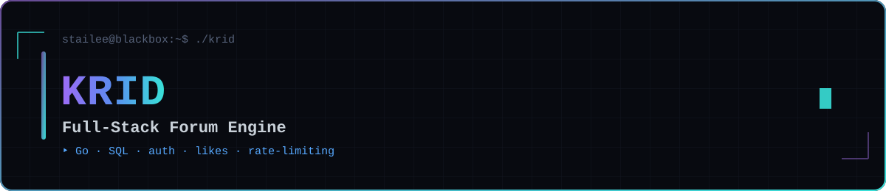

  

  
  
  
  

# KRID

simple forum developper en golang avec un system de register / logout afin de pouvoir poster des posts, repondres a ces derniers et egalement les liker avec un systeme de ratelimit ainsi qu'une fonctionnalitée de hash pour les mots de passe presents dans la DB

## Tech
Golang html css jss SQL

## Setup
StaiLee/Balik Back  Raphael/djibril/kaan front

## PB
certaines fonctionnalité sont presentes dans le code mais pas encore fonctionnel tel que les report ou l'administration, manque de temps
